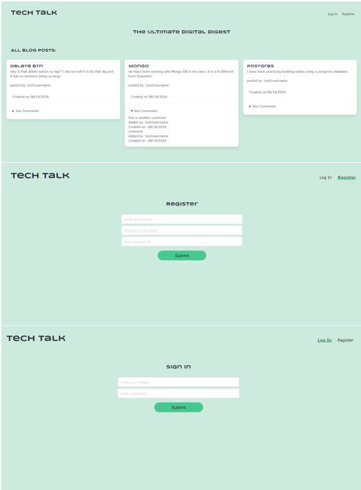
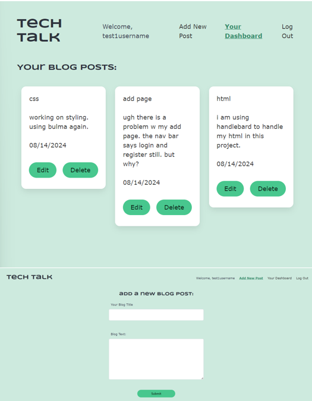
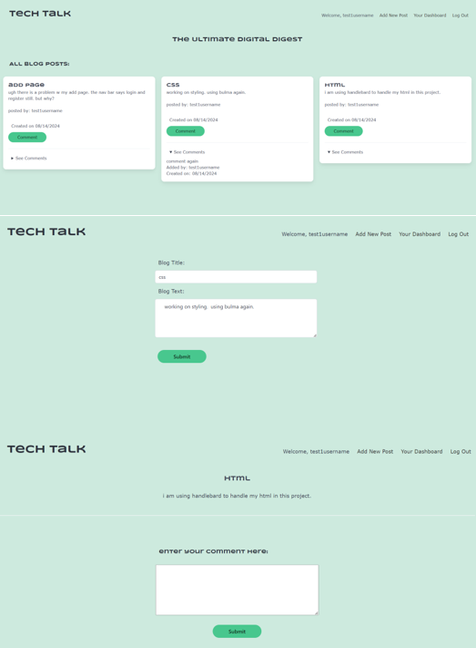

# tech-talk - blog-site

## Description

This application is a blog site for all things technology.  Users can view, add, update and delete their own blog posts.  On the homepage, users can view and comment on other's posts.  This site allows the tech community to share thoughts, ideas and so much more with one another.

## Installation 

"scripts": {
    "start": "node server.js",
    "dev": "nodemon server.js"
}

**see .env-Example for needed values

## Usage

deployed website: https://tech-blog-bato.onrender.com

## Testing

this back-end's routes were tested on Insomnia 9.3.2.

## Credits

coded and designed by Dana Castagna

with assistance from Xpert Learning Assistant & tutoring from edX Boot Camps LLC.

© 2024 edX Boot Camps LLC.

Insomnia 9.3.2

## License
MIT License

Copyright (c) 2024 Dana Castagna

Permission is hereby granted, free of charge, to any person obtaining a copy
of this software and associated documentation files (the "Software"), to deal
in the Software without restriction, including without limitation the rights
to use, copy, modify, merge, publish, distribute, sublicense, and/or sell
copies of the Software, and to permit persons to whom the Software is
furnished to do so, subject to the following conditions:

The above copyright notice and this permission notice shall be included in all
copies or substantial portions of the Software.

THE SOFTWARE IS PROVIDED "AS IS", WITHOUT WARRANTY OF ANY KIND, EXPRESS OR
IMPLIED, INCLUDING BUT NOT LIMITED TO THE WARRANTIES OF MERCHANTABILITY,
FITNESS FOR A PARTICULAR PURPOSE AND NONINFRINGEMENT. IN NO EVENT SHALL THE
AUTHORS OR COPYRIGHT HOLDERS BE LIABLE FOR ANY CLAIM, DAMAGES OR OTHER
LIABILITY, WHETHER IN AN ACTION OF CONTRACT, TORT OR OTHERWISE, ARISING FROM,
OUT OF OR IN CONNECTION WITH THE SOFTWARE OR THE USE OR OTHER DEALINGS IN THE
SOFTWARE.

## Features

- sign-in or register new user
- view community blog post whether a user or no registered
- if user, view, add, update and delete posts
- if user, leave comments on others' posts